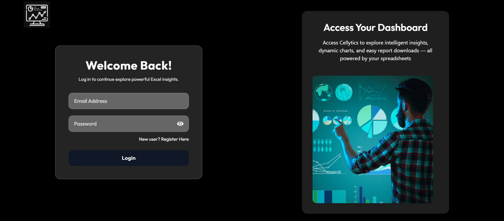
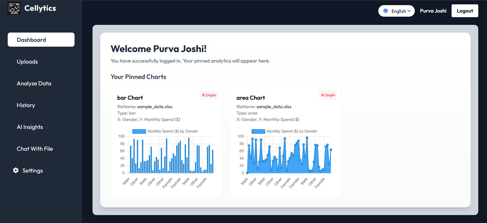
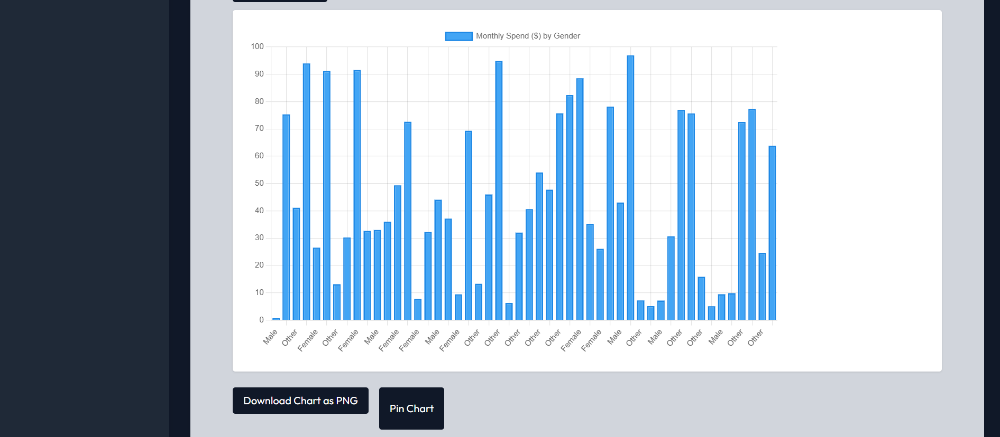
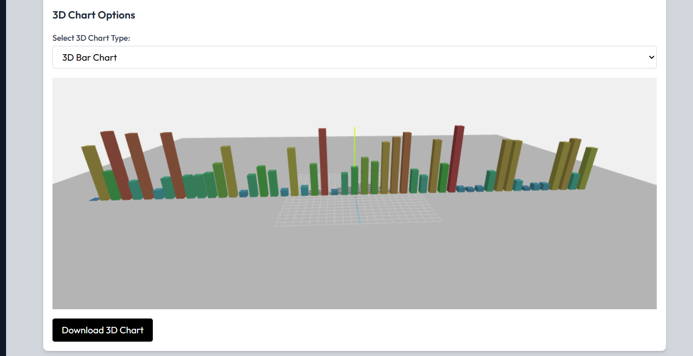
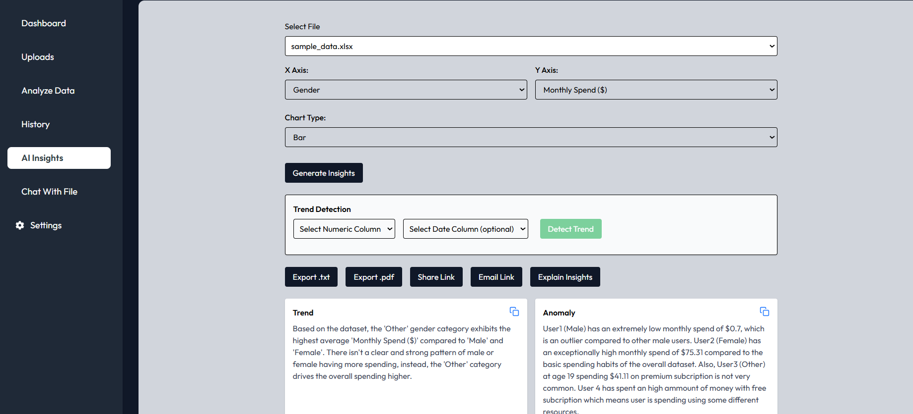
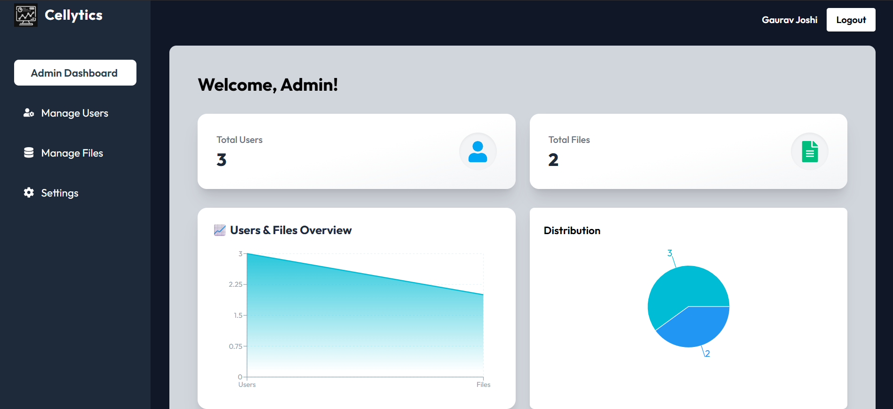
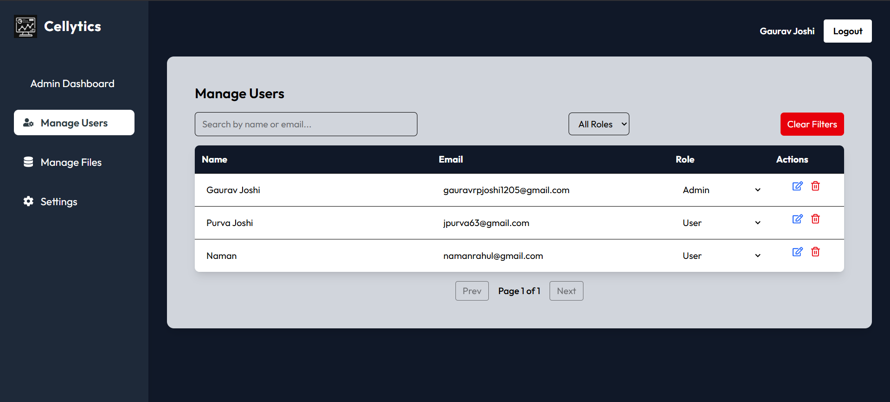
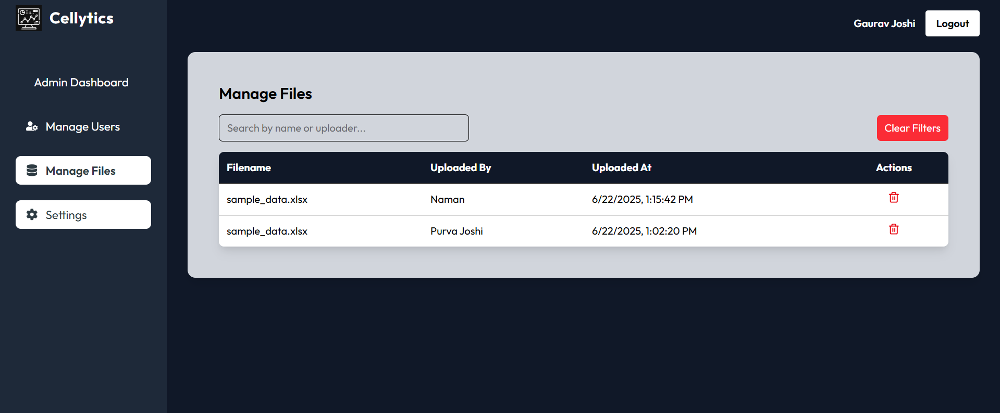

# Cellytics

Cellytics is a full-stack Excel analytics web platform developed as part of an internship project. It empowers users to seamlessly upload Excel files, conduct advanced data analysis, and visualize insights through a dynamic and user-friendly dashboard. The application incorporates secure authentication, role-based access control (admin and user), and a responsive, modern UI designed for a smooth analytical experience.

---

## Demo

👉 [Visit the deployed app](https://cellytics-main.vercel.app/)

---

##  Tech Stack

### Frontend

- React (Vite)
- Redux Toolkit
- Tailwind CSS

### Backend

- Node.js + Express
- MongoDB Atlas
- JWT for authentication
- bcryptjs for password hashing

---

## 📁 Project Structure

```
Cellytics/
├── client/        # React frontend
│   ├── src/
│   ├── public/
│   └── ...
├── server/        # Node.js backend
│   ├── models/
│   ├── routes/
│   ├── middleware/
│   └── ...
├── README.md
└── ...
```

---

##  Authentication & Authorization

- **User Registration & Login**: Implemented using JWT tokens.
- **Role-based Access**: Middleware to restrict access to admin-only routes.

---

##  Core Features

- **Excel File Upload**: Users can upload `.xlsx` or `.xls` files for analysis.
- **Data Parsing**: Backend processes Excel files and extracts relevant data.
- **Dashboard**: Visual representation of data using charts and tables.
- **User Roles**: Admins have additional privileges like managing users.

---

## To start the app:

### Prerequisites

- Node.js (v14 or above)
- MongoDB Atlas account

### Installation

1. **Clone the repository**:

   ```bash
   git clone https://github.com/Itsgauravvv/Cellytics
   cd Cellytics
   ```

2. **Setup Backend**:

   ```bash
   cd server
   npm install
   ```

   - Create a `.env` file in the `server` directory with the following:

     ```env
     MONGO_URI=your_mongodb_connection_string
     JWT_SECRET=your_jwt_secret
     GEMINI_API_KEY=your_gemini_api_key
     ```

   - Start the backend server:

     ```bash
     npm run dev
     ```

3. **Setup Frontend**:

   ```bash
   cd ../client
   npm install
   ```
   - Create a `.env` file in the `server` directory with the following:

     ```env
     VITE_API_BASE_URL=http://localhost:5000
     ```

   - Start the frontend development server:

     ```bash
     npm run dev
     ```
### Screenshots
- Front Page:


- User Dashboard:




- Admin Dashboard:



